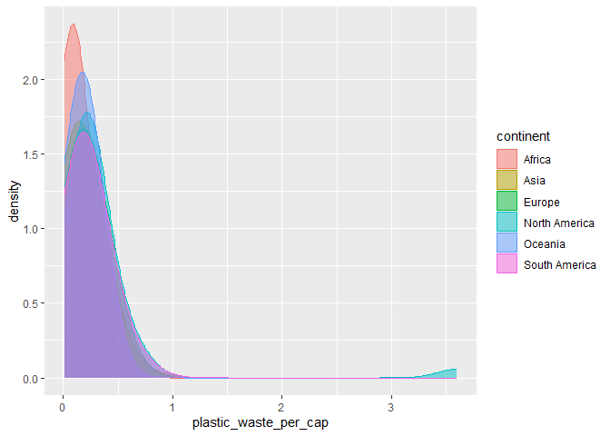

Lab 02 - Plastic waste
================
Ryan W
1/15/23

## Load packages and data

``` r
library(tidyverse) 
```

``` r
plastic_waste <- read.csv("data/plastic-waste.csv")
```

## Exercises

### Exercise 1

#### Exercise 1.1

What can you say about how the continents compare to each other in terms
of their plastic waste per capita?

From the visuals, it seems like Oceania and South America produce less
plastic waste per capita than the other five continents do.

``` r
ggplot(data = plastic_waste, aes(x = plastic_waste_per_cap)) +
  geom_histogram(binwidth = 0.2)
```

    ## Warning: Removed 51 rows containing non-finite values (`stat_bin()`).

<!-- -->

``` r
plastic_waste %>%
  filter(plastic_waste_per_cap > 3.5)
```

    ##   code              entity     continent year gdp_per_cap plastic_waste_per_cap
    ## 1  TTO Trinidad and Tobago North America 2010    31260.91                   3.6
    ##   mismanaged_plastic_waste_per_cap mismanaged_plastic_waste coastal_pop
    ## 1                             0.19                    94066     1358433
    ##   total_pop
    ## 1   1341465

``` r
ggplot(data = plastic_waste, aes(x = plastic_waste_per_cap)) +
  geom_histogram(binwidth = 0.2) + facet_wrap(~ continent)
```

    ## Warning: Removed 51 rows containing non-finite values (`stat_bin()`).

<!-- -->

### Exercise 2

#### Exercise 2.1

``` r
ggplot(data = plastic_waste,
       mapping = aes(x = plastic_waste_per_cap,
                     color = continent,
                     fill = continent)) +
  geom_density(alpha = 0.5, adjust = 5)
```

    ## Warning: Removed 51 rows containing non-finite values (`stat_density()`).

<!-- -->

#### Exercise 2.2

Describe why we defined the color and fill of the curves by mapping
aesthetics of the plot but we defined the alpha level as a
characteristic of the plotting geom.

Because we are coloring/filling based on a categorical variable:
continent. So it’s need to go in the area where we are defining the
variables we are mapping. The alpha, on the other hand, applies to the
whole visual, and is not associated with any variables. So it’s defined
as a characteristic of the plotting geom.

### Exercise 3

#### Exercise 3.1

The violin plot reveals the density of the data, while the boxplot only
reveals the central tendency and interquartile ranges.

``` r
ggplot(data = plastic_waste,
       mapping = aes(x = continent,
                     y = plastic_waste_per_cap)) +
  geom_boxplot()
```

    ## Warning: Removed 51 rows containing non-finite values (`stat_boxplot()`).

<!-- -->

``` r
ggplot(data = plastic_waste,
       mapping = aes(x = continent,
                     y = plastic_waste_per_cap,
                     color = continent,
                     fill = continent)) +
  geom_violin()
```

    ## Warning: Removed 51 rows containing non-finite values (`stat_ydensity()`).

<!-- -->

### Exercise 4

#### Exercise 4.1

``` r
ggplot(data = plastic_waste,
       mapping = aes(x = plastic_waste_per_cap, 
                     y = mismanaged_plastic_waste_per_cap)) +
  geom_point()
```

    ## Warning: Removed 51 rows containing missing values (`geom_point()`).

<!-- -->

The relationship is is positive – as plastic waste per capita increases,
mismanaged plastic waste per capita also increases.

#### Exercise 4.2

``` r
ggplot(data = plastic_waste,
       mapping = aes(x = plastic_waste_per_cap, 
                     y = mismanaged_plastic_waste_per_cap,
                     color = continent)) +
  geom_point()
```

    ## Warning: Removed 51 rows containing missing values (`geom_point()`).

<!-- -->

The plastic waste per capita - mismanaged plastic waste relationship
seems to generally hold for all continents. However, Africa and Asia
seem to have particularly strong relationships between these two
variables.

#### Exercise 4.3

``` r
ggplot(data = plastic_waste,
       mapping = aes(x = plastic_waste_per_cap, 
                     y = total_pop)) +
  geom_point()
```

    ## Warning: Removed 61 rows containing missing values (`geom_point()`).

<!-- -->

``` r
ggplot(data = plastic_waste,
       mapping = aes(x = plastic_waste_per_cap, 
                     y = coastal_pop)) +
  geom_point()
```

    ## Warning: Removed 51 rows containing missing values (`geom_point()`).

<!-- -->

There seems to be a mildly stronger linear association between plastic
waste per capita and the size of a country’s coastal population, than
there is with a country’s total population. However, I’m not sure if
this relationship would hold up to inferential testing.

### Exercise 5

``` r
ggplot(data = plastic_waste %>%
         filter(plastic_waste_per_cap < 3),
       mapping = aes(x = coastal_pop / total_pop, 
                     y = plastic_waste_per_cap)) +
  geom_point(aes(color = continent))+
  geom_smooth(color = "black")
```

    ## `geom_smooth()` using method = 'loess' and formula = 'y ~ x'

    ## Warning: Removed 10 rows containing non-finite values (`stat_smooth()`).

    ## Warning: Removed 10 rows containing missing values (`geom_point()`).

<!-- -->

``` r
labs(x = "Coastal population proportion (Coastal/Total population)", y = "Plastic waste per capita")
```

    ## $x
    ## [1] "Coastal population proportion (Coastal/Total population)"
    ## 
    ## $y
    ## [1] "Plastic waste per capita"
    ## 
    ## attr(,"class")
    ## [1] "labels"

There doesn’t seem to be much of relationship to speak of between
coastal population proportion, and plastic waste per capita. In other
words, the extent to which citizens live on the coast in a given country
is not associated with whether that country has a plastic waste problem.

## Pro-Tips

### Excercise 3

Try this :D

ggplot(data = plastic_waste, mapping = aes(x = continent, y =
plastic_waste_per_cap)) + geom_violin()+ geom_boxplot(width=.3,
fill=“green”) + stat_summary(fun.y=median, geom=“point”)

### Exercise 5

Helpful
reference:<http://www.sthda.com/english/wiki/ggplot2-themes-and-background-colors-the-3-elements>
